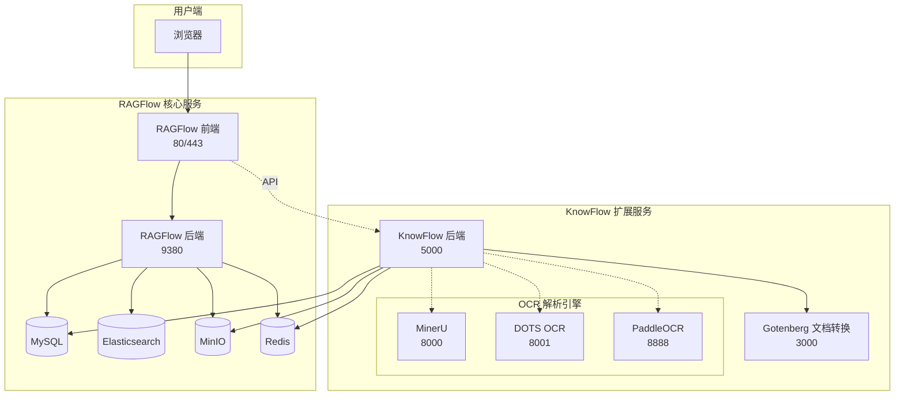

<div align="center">
  <br>

  # KnowFlow
  <p><strong>基于 RAGFlow 的企业级 RAG 知识库平台</strong></p>

  <p>
    <a href="https://www.knowflowchat.cn">官网</a> &middot;
    <a href="https://www.bilibili.com/video/BV1Vfg8zDEUf/">视频教程</a> &middot;
    <a href="knowflow/CHANGELOG.md">更新日志</a> &middot;
    <a href="#社区与支持">加入社区</a>
  </p>

</div>

---

## 项目简介

**KnowFlow** 是基于 [RAGFlow](https://github.com/infiniflow/ragflow) 深度优化的企业级开源知识库平台，专注于解决 RAG 从开源到生产落地的**最后一公里**问题。

当前适配 RAGFlow v0.20.5，在其基础上提供：

- **高精度文档解析** - 集成 MinerU / DOTS / PaddleOCR 多种 OCR 引擎，100% 坐标溯源精度
- **四种现代分块方法** - 智能 / 标题 / 正则 / 父子分块，基于 AST 语义分析
- **图文混排输出** - 图片、表格、公式在分块和回答中完整保留
- **企业级权限管理** - RBAC 权限控制、团队协作、管理员统一管控
- **开箱即用** - Docker Compose 一键部署，预配置管理员账户

---

## 目录

- [版本对比](#版本对比)
- [系统架构](#系统架构)
- [快速开始](#快速开始)
- [功能展示](#功能展示)
- [常见问题](#常见问题)
- [许可证](#许可证)
- [社区与支持](#社区与支持)

---

## 版本对比

### RAGFlow vs KnowFlow 社区版 vs KnowFlow 商业版

#### 文档解析

| 功能 | RAGFlow 开源版 | KnowFlow 社区版 | KnowFlow 商业版 |
|------|---------------|----------------|----------------|
| DeepDOC 解析 | ✅ | ✅ | ✅ |
| MinerU 解析 | ✅ | ✅ v2.5.4 | ✅ v3.1.1 |
| DOTS 解析 | ❌ | ✅ | ❌ |
| PaddleOCR 解析 | ✅ | ✅ 老版本 | ✅ v1.5 |
| 坐标溯源精度 | ~97%（OCR 匹配） | 100%（block 映射） | 100% |
| 图文混排输出 | 基础支持，存在限制 | ✅ 图片/表格/公式完整保留 | ✅ 更稳定 |
| 20+ 文档格式 | ✅ | ✅（含 Gotenberg 转换） | ✅ PPT/.docx 直接解析（非格式转换） |

#### 分块方法

| 功能 | RAGFlow 开源版 | KnowFlow 社区版 | KnowFlow 商业版 |
|------|---------------|----------------|----------------|
| 原生分块（naive/paper/book/qa） | ✅ | ✅ 全部继承 | ✅ |
| 智能分块（Smart） | ❌ | ✅ AST 语义分析 | ✅ 全面优化 |
| 标题分块（Title） | ❌ | ✅ 按标题层级划分 | ✅ 层级筛选 + 标题自动补充 |
| 正则分块（Regex） | ❌ | ✅ 自定义正则 | ✅ 层级筛选优化 |
| 父子分块（Parent-Child） | ✅ | ✅ 双层嵌套检索 | ✅ 支持预览和编辑 |
| Page 分块 | ❌ | ❌ | ✅ 单独支持 |
| Markdown 预览与编辑 | ❌ | ❌ | ✅ OCR 后可预览编辑 |
| 分块 Markdown 渲染 | 纯文本 | ✅ 标题/公式/列表 | ✅ |

#### 检索与问答

| 功能 | RAGFlow 开源版 | KnowFlow 社区版 | KnowFlow 商业版 |
|------|---------------|----------------|----------------|
| 向量数据库 | Elasticsearch | Elasticsearch | ✅ Milvus |
| 向量检索 | ✅ | ✅ | ✅ |
| 混合检索 | ✅ ES BM25 | ✅ ES BM25 | ✅ 统一分词优化 Milvus BM25 |
| 多模态内容理解 | 基础支持 | ✅ | ✅ VLM 图片描述增强 |
| Agentic RAG 深度阅读 | ❌ | ❌ | ✅ locate-then-read |
| ColPali 多模态检索 | ❌ | ❌ | ✅ |
| Agent 工作流 | ✅ | ✅ | ✅ |

#### 企业管理与集成

| 功能 | RAGFlow 开源版 | KnowFlow 社区版 | KnowFlow 商业版 |
|------|---------------|----------------|----------------|
| 用户管理 | 自由注册 | ✅ 管理员统一管理 | ✅ |
| RBAC 权限管理 | ❌ | ✅ 知识库级权限 | ✅ Agent/聊天助手/文件 + Redis 缓存 + 多层级组织架构 |
| 团队协作 | ❌ | ✅ 团队管理、模型配置继承 | ✅ |
| 三方平台集成 | ❌ | ✅ Dify | ✅ 企业微信/钉钉/飞书/MaxKB/Dify |
| 负载均衡部署 | ❌ | ❌ | ✅ |
| 纯离线部署 | ✅ | ✅ | ✅ |
| RAG 评估系统 | ❌ | ❌ | ✅ |
| 前端 UI | 官方 UI | ✅ 企业级重设计 | ✅ |
| API 接口 | ✅ | ✅ 含 RBAC + MinerU API | ✅ |
| 适配 RAGFlow 版本 | 最新 | v0.20.5 | v0.22.1 |
| 授权协议 | Apache-2.0 | AGPL-3.0 | 商业许可 |
| 技术支持 | 社区 | 社区 | 专业支持 |

### 核心优势总结

| 优势 | 说明 |
|------|------|
| **多 OCR 引擎** | MinerU（行级精度）、DOTS（高速解析）、PaddleOCR（块级识别），按需选择 |
| **现代分块方法** | 智能/标题/正则/父子分块，商业版单独支持 Page 分块，AST 语义分析，表格和代码块完整性保证 |
| **100% 坐标溯源** | 基于 block 按行映射，消除 OCR 相似度匹配误差 |
| **图文混排** | 图片、表格、公式完整保留在分块和回答中 |
| **企业级管理** | RBAC 权限 + 多层级组织架构 + 团队协作 + 管理员统一管控 |
| **多平台集成** | Dify / 企业微信 / 钉钉 / 飞书 / MaxKB（商业版） |
| **插件化架构** | 独立微服务增强 RAGFlow，不修改核心代码，版本升级无忧 |

> 获取商业版：微信联系 `skycode007`（备注"商业版咨询"）

---

## 系统架构

KnowFlow 采用插件化微服务架构，作为独立服务增强 RAGFlow，不修改其核心代码：



**架构特点：**

- **插件化** - KnowFlow 作为独立微服务，不修改 RAGFlow 核心代码，版本升级无忧
- **共享数据层** - 复用 RAGFlow 的 MySQL、MinIO、Redis 等基础设施
- **多引擎支持** - MinerU、DOTS、PaddleOCR 三种 OCR 引擎可按需部署
- **格式转换** - 内置 Gotenberg 服务，PPT/Word/Excel 等格式自动转换

---

## 快速开始

### Docker Compose 部署（推荐）

**前置要求：** Docker 20.10+ / Docker Compose 2.0+ / 8GB+ 内存 / 可选 NVIDIA GPU

#### 1. 克隆项目

```bash
git clone https://github.com/knowflow-ai/KnowFlow.git
cd KnowFlow/docker
```

#### 2. 配置 KnowFlow Server

```bash
cp knowflow-server/settings.yaml.example knowflow-server/settings.yaml
vim knowflow-server/settings.yaml
```

配置示例：

```yaml
mineru:
  default_backend: "pipeline"
  fastapi:
    url: "http://localhost:8000"   # MinerU 服务地址
    timeout: 60000

dots:
  vllm:
    url: "http://localhost:8001"   # DOTS 服务地址（可选）
    model_name: "dotsocr-model"
    timeout: 60000

paddleocr:
  url: "http://localhost:8888"     # PaddleOCR 服务地址（可选）
  timeout: 30000
```

详细配置说明：[docker/knowflow-server/README.md](docker/knowflow-server/README.md)

#### 3. 部署 OCR 解析服务（可选）

三种 OCR 服务可同时部署，系统根据用户选择的布局解析器自动调用对应服务。

<details>
<summary><b>选项 A：MinerU（推荐，行级精度）</b></summary>

```bash
cd mineru/
docker compose up -d
docker compose logs -f
```

服务端口：API 8000 / VLM 30000（可选）

详细说明：[docker/mineru/README.md](docker/mineru/README.md)

</details>

<details>
<summary><b>选项 B：DOTS（高速解析）</b></summary>

```bash
cd dots/

# 下载模型
pip install modelscope
modelscope download --model rednote-hilab/dots.ocr --local_dir ./weights/DotsOCR

docker compose up -d
docker compose logs -f
```

服务端口：8000

详细说明：[docker/dots/README.md](docker/dots/README.md)

</details>

<details>
<summary><b>选项 C：PaddleOCR（块级识别）</b></summary>

```bash
cd paddleocr/
docker compose up -d
docker compose ps
```

服务端口：8888

特点：7+ 种 block_label 类型、自动标题层级推断（H1-H6）、块级坐标

详细说明：[docker/paddleocr/README.md](docker/paddleocr/README.md)

</details>

#### 4. 启动主服务

```bash
cd docker/

# GPU 模式
docker compose -f docker-compose-gpu.yml up -d

# CPU 模式
docker compose up -d
```

#### 5. 访问系统

| 入口 | 地址 |
|------|------|
| 前端 | `http://localhost` |
| API | `http://localhost:9380` |
| 默认账户 | `admin@gmail.com` / `admin` |

> 首次登录后请立即修改默认密码。

---

### 源码部署

<details>
<summary>展开源码部署步骤</summary>

**前置要求：** Python 3.9+ / Node.js 16+ / pnpm

#### KnowFlow 后端

```bash
cd knowflow/server
python3 -m venv venv
source venv/bin/activate
pip install -r requirements.txt

cd knowflow/
./scripts/install.sh --local
python3 app.py
```

#### RAGFlow 后端

```bash
source .venv/bin/activate
export PYTHONPATH=$(pwd)
# 可选：export HF_ENDPOINT=https://hf-mirror.com
./local_entrypoint.sh
```

#### RAGFlow 前端

```bash
cd web
pnpm install
pnpm dev
```

</details>

---

## 功能展示

### 全新 UI 界面

基于 RAGFlow 二次开发的企业级界面：

<div align="center">
  
</div>

<div align="center">
  
</div>

<div align="center">
  
</div>

### 用户与权限管理

<div align="center">
  
</div>

- RBAC 权限控制，知识库级精细化权限分配；商业版支持多层级组织架构
- 管理员统一管理用户，移除自由注册入口
- 团队管理、模型配置继承，降低配置复杂度
- 支持完全离线环境部署

### 图文混排与智能分块

支持 PPT、Word、Excel、PDF、图片等 20+ 种格式；商业版对 PPT、.docx 直接解析，非格式转换。支持六种分块策略：

| 分块方法 | 算法 | 适用场景 |
|---------|------|---------|
| Smart（智能） | AST 语义分析，保证表格/代码块完整 | 通用文档 |
| Title（标题） | 按标题层级严格划分 | 技术文档、手册 |
| Regex（正则） | 自定义正则表达式分割 | 特殊格式文档 |
| Parent-Child（父子） | 双层嵌套，子块检索 + 父块上下文 | RAG 系统 |
| Page（页级） | 按页面独立分块，商业版单独支持 | 版式固定、页级溯源场景 |
| 原生分块 | RAGFlow naive/paper/book/qa 等 | 兼容已有配置 |

<div align="center">
  
</div>

### 企业微信集成

<div align="center">
  
</div>

详细配置：`server/services/knowflow/README.md`

---

## 常见问题

<details>
<summary><b>如何启用 GPU 加速？</b></summary>

```bash
# 安装 nvidia-container-toolkit
distribution=$(. /etc/os-release;echo $ID$VERSION_ID)
curl -s -L https://nvidia.github.io/libnvidia-container/gpgkey | sudo apt-key add -
curl -s -L https://nvidia.github.io/libnvidia-container/$distribution/libnvidia-container.list | \
  sudo tee /etc/apt/sources.list.d/nvidia-container-toolkit.list

sudo apt-get update
sudo apt-get install -y nvidia-container-toolkit
sudo systemctl restart docker
```

启动时使用 `docker compose -f docker-compose-gpu.yml up -d`。

</details>

<details>
<summary><b>性能优化建议</b></summary>

- 启用 GPU 加速文档解析
- 为容器分配 8GB+ 内存
- 使用 SSD 存储提升 I/O
- 外网访问需配置防火墙规则

</details>

---

## 许可证

本项目采用 [AGPL-3.0](LICENSE) 许可证。允许自由使用、修改和分发，但通过网络提供服务时必须开源修改内容。

需要商业许可请联系：微信 `skycode007`（备注"商业授权"）

---

## 社区与支持

- **微信公众号** - KnowFlow 企业知识库
- **交流群** - 加微信 `skycode007`，备注"加群"
- **问题反馈** - [GitHub Issues](https://github.com/knowflow-ai/KnowFlow/issues)

### 鸣谢

- [RAGFlow](https://github.com/infiniflow/ragflow) - 核心 RAG 框架

---

<div align="center">

[](https://star-history.com/#knowflow-ai/KnowFlow&Date)

如果这个项目对您有帮助，欢迎点个 Star

</div>
