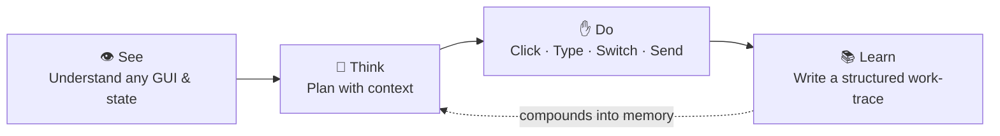

<a name="readme-top"></a>

<div align="center">

<h1>SightFlow · The Open-Source Working Memory Engine</h1>

<p><strong>Bring AI into the real software world — read the screen, get the job done, and accumulate on-the-job experience.</strong></p>

<p>
  <a href="./README.md"><b>English</b></a>
  &nbsp;·&nbsp;
  <a href="./README.zh-CN.md">简体中文</a>
</p>

<p>
  <a href="LICENSE"></a>
  <a href="https://github.com/sightflow-dev/sightflow-desktop-agent/stargazers"></a>
  <a href="https://github.com/sightflow-dev/sightflow-desktop-agent/network/members"></a>
  
  <a href="https://discord.com/invite/8H6KpbXq3t"></a>
  <a href="https://sightflow.dev"></a>
</p>

<p>
  <a href="#-getting-started"><b>Get Started</b></a> ·
  <a href="#-how-it-works--see--think--do--learn"><b>How It Works</b></a> ·
  <a href="#-configuration"><b>Configuration</b></a> ·
  <a href="https://sightflow.dev"><b>Website</b></a>
</p>

</div>

---

## Overview

> **SightFlow does not replace the LLM. It completes the one layer the LLM cannot reach** — turning screen pixels into structured semantics, and task intent into real operations.

<div align="center">
  <video src="https://github.com/user-attachments/assets/fdceada5-940b-45d1-bf96-2d26df651809" width="100%" controls></video>
</div>

An enterprise's heaviest work does not live inside an LLM API. It lives **on the screen, inside human workflows**:

- **Many surfaces** — a single task spans multiple applications and windows.
- **Long horizons** — read → judge → act → follow up → recover. It is never one button click.
- **Tacit experience** — the real know-how lives in every judgment a senior operator makes, not in any document.

Large language models solved *thinking* and *speaking*. They have **not** yet solved *learning the job* and *doing it well*. SightFlow is the desktop runtime that closes that gap — an agent that **sees** any interface, **thinks** in context, **acts** like a human operator, and **learns** from every execution.

---

## ✦ How It Works — See · Think · Do · Learn



| Stage | What happens |
| :-- | :-- |
| **See** | A vision model understands any software UI and its current state. |
| **Think** | The agent plans using context and history to decide *what to do*. |
| **Do** | It clicks, types, switches windows, sends, and records — exactly like a human operator. |
| **Learn** | Every execution is written as a structured **work-trace**, building durable working memory. |

> This is not an app. It is a **working memory engine** that puts AI on the job.

---

## ✦ The Work Memory Runtime

Every execution becomes **one structured `work-trace`**:

```text
work-trace = {
  timestamp,    # when it happened
  ui_state,     # what the screen looked like
  rationale,    # WHY this decision was made
  action,       # click / type / switch / send
  result        # what happened next
}
```

Continuously written and replayable step by step, the runtime offers **three capabilities ordinary RPA cannot**:

| Capability | Why it matters |
| :-- | :-- |
| 🔁 **Replay** | When something breaks, review every step — down to the decision behind it. |
| 📊 **Eval** | Swap models or versions and compare outcomes consistently. |
| 🧬 **Inherit** | The judgment behind a task is captured once and reused, instead of living only in someone's head. |

> Others record **the steps**. SightFlow records **why each step was taken**. That is the leap from **RPA** to a true **Agent Runtime**.

Built for real-world, sensitive environments:

- 🔒 **Local-first execution** — work traces stay on the machine by default; data never has to leave.
- 🧾 **Fully auditable** — every action trace can be inspected end to end.
- 🔄 **Model-agnostic** — adapts to vision LLMs and is switchable across providers.

---

## ✦ Core Capabilities

From WeChat and WeCom to **any desktop software**, SightFlow lets AI work where there is **no API**.

- **Universal Vision-Based RPA** — No fragile webhooks or private protocols. SightFlow behaves like a human user: reading chat bubbles, manipulating inputs, and navigating native UIs through abstract visual recognition.
- **State-of-the-Art Vision** — A unified vision layer extracts unread notification dots, message lists, and chat-bubble text in real time across complex, dynamic layouts.
- **Agentic Workspaces** — Turn unstructured chat requests into actionable node-workflows and API calls, fully programmable via local AI.

---

## 🚀 Getting Started

SightFlow Desktop Agent is a cross-platform client built on **Electron · electron-vite · React · TypeScript**, driven by a Vision-Language Model (VLM).

**Prerequisites:** Node.js (LTS) and npm.

### 1. Install dependencies

```bash
npm install
```

### 2. Run in development

```bash
npm run dev
```

> On first launch, pick your **target application** and complete the region selection, then open **Settings** to enter your API key and confirm the active Provider.

### 3. Build a release

```bash
npm run build:win     # Windows
npm run build:mac     # macOS
npm run build:linux   # Linux
```

---

## ⚙️ Configuration

Desktop configuration has two layers:

- **Base configuration** — a Volcengine Ark API key powering visual grounding and the built-in Doubao agent.
- **Agent / Provider** — the provider responsible for chat analysis and reply generation.

### What the key is used for

1. **Smart replies** — the model analyzes chat-window screenshots and generates natural responses (with an anti-self-loop guard).
2. **VLM visual grounding** — from a screenshot and a prompt, the model locates on-screen UI controls and returns click coordinates, driving a pure-vision RPA flow.

### Steps

1. Open [Volcengine Console → Ark](https://console.volcengine.com/ark), enable the service, and generate your API key.
2. Launch the app and click the settings button at the bottom-right of the main window.
3. Under **Base configuration**, enter the API key. The default Base URL `https://ark.cn-beijing.volces.com/api/v3` rarely needs changing.
4. Under **Agent**, select the active Provider. The built-in default is **Doubao Seed** (`doubao-seed-2-0-lite-260215`).

### Interface preview

| Main | Base Configuration | Agent / Provider |
| :--: | :--: | :--: |
|  |  |  |

### Target applications & selection mode

The main window offers a **Target Application** shortcut that decides how the desktop client measures the chat-window layout:

- **WeChat** and **WeCom** use VLM auto-detection of the window region by default.
- **DingTalk, Feishu, Slack, Telegram**, and other desktop apps default to **manual selection**.
- When manual selection is required, click **Start Selection** and outline three regions in order: the **conversation list**, the **chat content area**, and the **input box**.
- Selections are saved locally per target application and reused on subsequent launches; you can re-select at any time.

> VLM vs. manual selection only affects *how layout is measured*. Runtime screenshots, content analysis, reply generation, and message sending all consume the same layout result.

### Provider Hub

SightFlow abstracts "analyze a screenshot and generate a reply" into an independent **Provider**. A provider declares its config schema via `manifest.json` and, through its bundle entry, receives a chat screenshot and returns `reply_text`, `skip`, and `error` events.

- The candidate list is fetched by default from `https://sightflow.dev/provider-hub.json`.
- The hub only tracks each provider's `manifestUrl`; UI fields come from each provider's manifest.
- Results are cached locally after first load; the local cache is preferred unless you refresh via the button next to the Agent title.
- **Doubao Seed** is always retained locally as the default provider, so there is always an option if the remote list is unavailable.

External provider integration is documented in the [Chat Provider docs](./docs/provider.md). A Doubao / Volcengine Ark sample remains in the repo for reference:

```text
resources/providers/volcengine-ark/manifest.json
resources/providers/volcengine-ark/provider.bundle.js
```

> **Recommended dev setup:** [VS Code](https://code.visualstudio.com/) + [ESLint](https://marketplace.visualstudio.com/items?itemName=dbaeumer.vscode-eslint) + [Prettier](https://marketplace.visualstudio.com/items?itemName=esbenp.prettier-vscode).

---

## 🔐 Security & Data Ownership

SightFlow's work traces are stored **locally by default** — never uploaded to any server, never included in any public training dataset. Open-source code does **not** mean open data: **your work data always belongs to you.**

---

## 🤝 Contributing & Community

We believe **Agent Computer-Use will be foundational infrastructure for the next decade of AI**. If you want to help build it, come join us.

- 💬 **[Join our Discord](https://discord.com/invite/8H6KpbXq3t)** — co-build with the community.
- ⭐ **[Star the repo](https://github.com/sightflow-dev/sightflow-desktop-agent)** — it genuinely helps.
- 🛠 **Contribute** — issues and pull requests are welcome.

---

## 📄 License

Released under the [Apache License 2.0](LICENSE).

---

## 📬 Contact

- 🌐 **Website:** [sightflow.dev](https://sightflow.dev)
- ✉️ **Email:** [builder@sightflow.dev](mailto:builder@sightflow.dev)
- 💬 **Discord:** [Join the server](https://discord.com/invite/8H6KpbXq3t)

<div align="center"><sub>© 2026 SightFlow. Released under the Apache License 2.0.</sub></div>

<p align="right"><a href="#readme-top">↑ Back to top</a></p>
